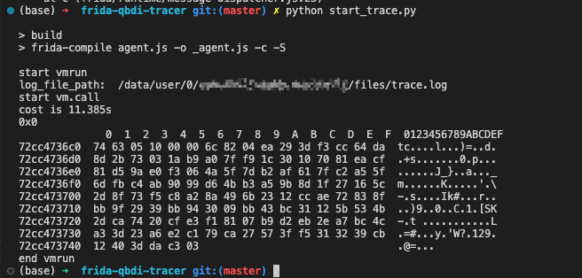
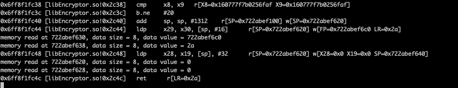

# frida-qbdi-tracer

## 环境

需要安装node，python，frida

## 使用方法

1. 修改warp_vm_run.js中把warp_vm_run函数，把该函数修改成自己想要的主动调用，目前仅支持native
2. python start_trace.py

## Trace结果

运行命令:



日志如下:


## 异常问题
```
libQBDI.so library not found...
frida.core.RPCException: Error: Invalid QBDI version !
```

以上2个异常情况，可能是push libQBDI.so到手机时出了问题，重新运行python start_trace.py即可，其他异常情况待定

如果trace过程中遇到其他异常情况，可以加我星球，再进行解答。
